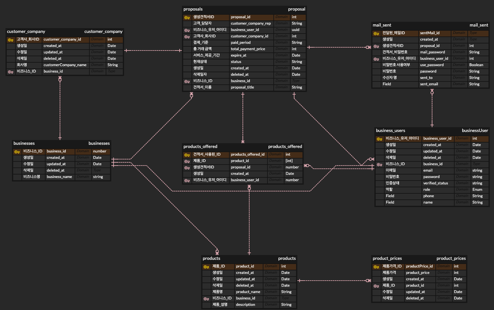

<h1>D.CLOSER</h1>

<h2>D.CLOSER가 제공하는 가치</h2>
<li>스마트 견적서는 입력된 정보를 기반으로 자동으로 계산하여 정확한 견적서를 생성하며, 견적서 작성 프로세스에서 발생하는 <b>인적 오류를 최소화</b>할 수 있습니다.
</li>
<li>스마트 견적서는 기존의 견적서 작성 프로세스를 개선하고, 보다 효율적이고 정확한 견적서 작성을 지원합니다.
</li>
<li> 사용자는 스마트 견적서를 통해 제품, 가격, 할인 등의 정보를 쉽게 입력하고, 고객의 요구 사항에 따라 적절한 옵션을 제공할 수 있습니다.
</li>
<li>D.CLOSER는 클라우드 서비스를 기반으로 B2B 영업조직에게 원스톱 Deal Closing 서비스를 제공하는 SaaS 기업입니다. D.CLOSER는 영업팀이 계약서 작성, 결재 및 관리, e-Signature, 수금 등의 프로세스를 간편하고 신속하게 처리할 수 있도록 지원합니다.
</li>

<h2>D.CLOSER의 핵심 기능</h2>

<h3>견적서 작성 및 관리</h3>
<li>D.CLOSER는 사용자가 템플릿을 이용해 간단하게 견적서를 작성할 수 있도록 지원하며, 기존 견적서를 업로드하거나 D.CLOSER 내에서 작성된 견적서를 관리할 수 있습니다.</li>

<li>D.CLOSER는 사용자 친화적인 UI/UX로 사용이 간편하며, 기업 규모에 상관없이 모든 B2B 영업조직에게 적용할 수 있습니다. 또한, 클라우드 기반 SaaS 서비스이기 때문에, 보안성과 가용성이 뛰어나며, 이를 통해 사용자는 언제 어디서든 서비스를 이용할 수 있습니다.</li>

 

테이블 구성은 아래와 같습니다.

